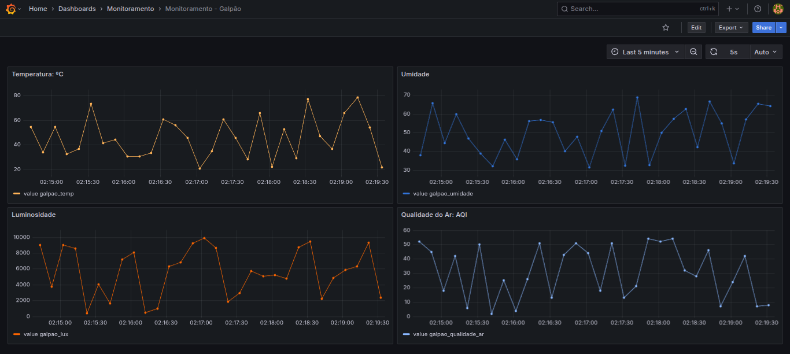

# Trabalho Final Ciência de Dados na IoT

### 🎯 Objetivo

Desenvolver um pipeline IoT completo para monitoramento de um
ambiente simulado, com sensores virtuais, armazenamento em banco de
dados e visualização via Grafana.

## Cenário: Monitoramento Ambiental de um Galpão Industrial

Monitorar as condições ambientais de um galpão industrial que armazena equipamentos sensíveis. A empresa precisa acompanhar a temperatura, umidade, qualidade do ar, e luminosidade em tempo real, com histórico de dados e gráficos de fácil visualização.

## Instação / Deploy

Para instruções detalhadas de instalação, por favor, consulte o [Guia de Instalação](docs/INSTALL.md).

## Dashboards

O projeto apresenta 4 Dashboards provisionados (gerados estáticamente através de um JSON) organizados dentro do painel Monitoramento - Galpão, dentro da pasta Monitoramento no Grafana.

