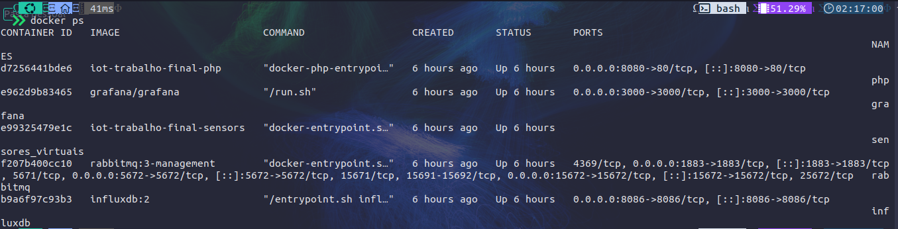

## Requisitos

É necessário ter pré instalado na máquina de destino as ferramentas:

```bash
  git
  php^8
  nodejs^20
  composer
  docker
```

## Instalação / Deploy

As instruções detalhadas de instalação desta aplicação envole o seguinte processo:

- **Clonar o Repositório:**
  ```bash
  git clone https://github.com/pedromoreira49/iot_trabalho_final.git
  cd iot_trabalho_final
  ```
- **Instalar Dependências: PHP**
  ```bash
  composer install
  ```
- **Instalar Dependências: Nodejs**
  ```bash
  cd sensors
  npm install
  ```
- **Variáveis de Ambiente:** Definir todas as variáveis de ambiente necessárias para a conexão com o RabbitMQ e InfluxDB.
  ```bash
  cp .env.example .env
  ```
- **Configuração:** Configurações de conexão com o RabbitMQ (host, porta, credenciais, nome da fila) podem precisar ser definidas em variáveis de ambiente ou em um arquivo de configuração.

  ```bash
  RABBITMQ_HOST=
  RABBITMQ_USER=
  RABBITMQ_PASSWORD=
  RABBITMQ_VHOST=
  ```

- **Configuração:** Também é necessário definir o organização, bucket e token para InfluxDB. (Para gerar o token do INFLUX, é recomendável utilizar [esta ferramenta](https://it-tools.tech/token-generator)).
  ```bash
    INFLUX_ORG=
    INFLUX_BUCKET=
    INFLUX_TOKEN=
  ```
- **Configuração do Ambiente:** Para garantir que todos os pré-requisitos e dependências estejam instalados no ambiente de produção, deve-se informar as credenciais no arquivo `docker-compose.yml`.

  ```bash
    rabbit:
      ...
      environment:
        RABBITMQ_DEFAULT_USER: <user>
        RABBITMQ_DEFAULT_PASS: <password>
    influxdb:
      ...
      environment:
        DOCKER_INFLUXDB_INIT_USERNAME: <admin>
        DOCKER_INFLUXDB_INIT_PASSWORD: <password>
        DOCKER_INFLUXDB_INIT_ORG: <org_example>
        DOCKER_INFLUXDB_INIT_BUCKET: <bucket_example>
        DOCKER_INFLUXDB_INIT_ADMIN_TOKEN: <token>
  ```

  É necessário informar o acesso para os sensores virtuais:

  ```javascript
  const client = connect("mqtt://rabbitmq:1883", {
    clientId: "galpao_luminosidade",
    username: "", // Adc user rabbitmq
    password: "", // Adc password rabbitmq
    reconnectPeriod: 3000,
    connectTimeout: 10_000,
  });
  ```

- **Execução:** Utilizar Docker/Docker Compose para conteinerização para manter a aplicação em execução de forma robusta e persistente.

  ```bash
  docker compose up -d
  ```

**Observação Importante:** Recomenda-se consultar o status dos containers para checar sua disponibilidade. Após o comando `docker compose up -d` deve-se ter 5 containers rodando na máquina alvo. Para verificar, rode o comando:

```bash
docker ps
```

O retorno deve ser algo parecido com a seguinte imagem:

